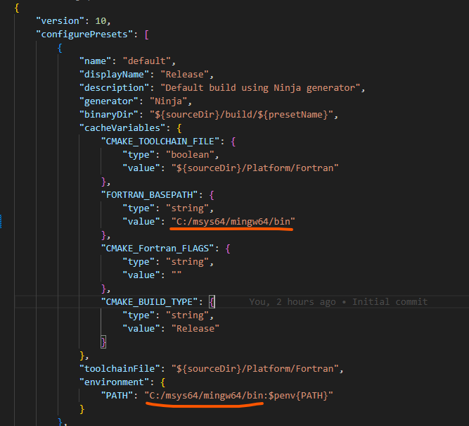
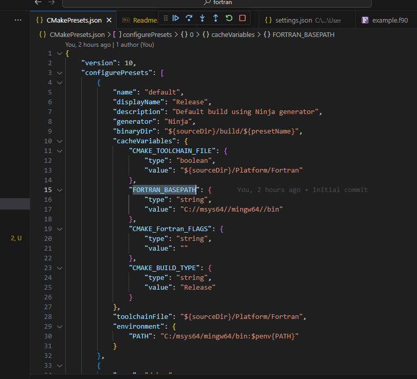
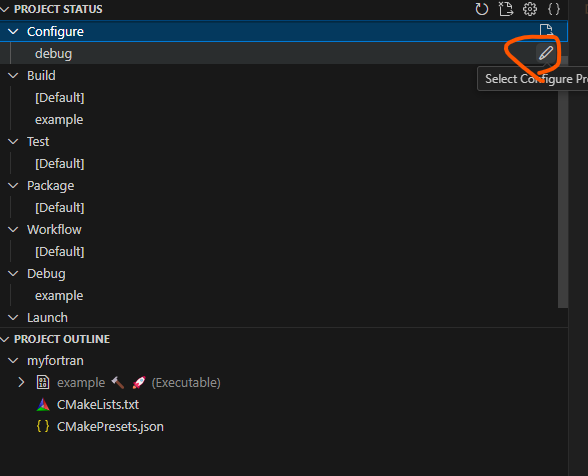
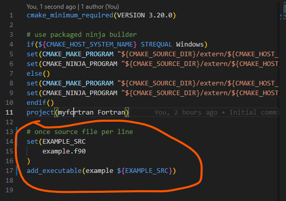
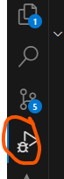
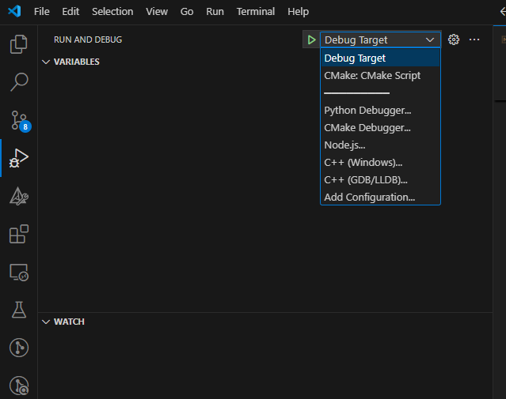

# Setup Instructions

### Open folder in vscode

You will be prompted to install extensions; install them.

### Edit CMakePresets.json

Build settings are in `CMakePresets.json`.  The important path is
`FORTRAN_BASEPATH` which should be set to the base path of the fortran compiler.  
Note that you must also set this in the `PATH` section:

Also see `CMAKE_Fortran_FLAGS.`

### Configure cmake
Open the CMakeTools tab:

Select debug preset

Build, press f7 or click here:

### Add source files
Open `CMakeLists.txt`
You can add executables with `add_executable`, e.g.

## Debugging
Open Debugging tab

Select "Debug Target":

